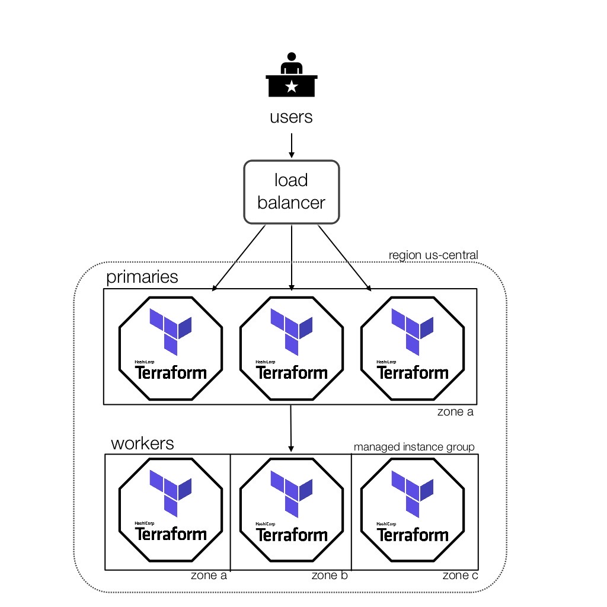

# Terraform-Google-TFE-HA (BETA)

This module installs Terraform Enterprise HA BETA onto 1 or more gcp instances in DEMO mode. All data is stored on the instance(s) and is not preserved. 

An Ubuntu Bionic (18.04 LTS) image is chosen by default, but this config supports previous version of Ubuntu as well as Red Hat Enterprise Linux 7.2-7.7 (v8 is not supported.)

_example architecture_

Please contact your Technical Account Manager for more information, and support for any issues you have.

## Inputs

| Name | Description | Type | Default | Required |
|------|-------------|:----:|:-----:|:-----:|
| cert | Certificate file or gcp cert link | string | n/a | yes |
| creds | Name of credential file | string | n/a | yes |
| dnszone | Managed DNS Zone name | string | n/a | yes |
| domain | domain name | string | n/a | yes |
| frontenddns | DNS name for load balancer | string | n/a | yes |
| license\_file | License file | string | n/a | yes |
| project | Name of the project to deploy into | string | n/a | yes |
| publicip | the public IP for the load balancer to use | string | n/a | yes |
| sslpolicy | SSL policy for the cert | string | n/a | yes |
| subnet | name of the subnet to install into | string | n/a | yes |
| airgap\_installer\_url | URL to replicated's airgap installer package | string | `"https://install.terraform.io/installer/replicated-v5.tar.gz"` | no |
| airgapurl | airgap url | string | `"none"` | no |
| encpasswd | encryption password for the vault unseal key. save this! | string | `""` | no |
| external\_services | object store provider for external services. Allowed values: gcs | string | `""` | no |
| gcs\_bucket | Name of the gcp storage bucket | string | `""` | no |
| gcs\_credentials | Base64 encoded credentials json to access your gcp storage bucket. Run base64 -i <creds.json> -o <credsb64.json> and then copy the contents of the file into the variable | string | `""` | no |
| gcs\_project | Project name where the bucket resides | string | `""` | no |
| image\_family | The image family, choose from ubuntu-1604-lts, ubuntu-1804-lts, or rhel-7 | string | `"ubuntu-1804-lts"` | no |
| install\_type | Switch to production for external services. Defaults to demo mode | string | `"poc"` | no |
| pg\_dbname | Database name | string | `""` | no |
| pg\_extra\_params | Extra connection parameters such as ssl=true | string | `""` | no |
| pg\_netloc | Database connection url | string | `""` | no |
| pg\_password | Base64 encoded database password | string | `""` | no |
| pg\_user | Database username | string | `""` | no |
| primary\_count | Number of primary nodes to run, must be odd number | string | `"1"` | no |
| primary\_machine\_type | Type of machine to use | string | `"n1-standard-4"` | no |
| primaryhostname | hostname prefix | string | `"ptfe-primary"` | no |
| region | The region to install into. | string | `"us-central1"` | no |
| release\_sequence | Replicated release sequence | string | `"latest"` | no |
| secondary\_machine\_type | Type of machine to use for secondary nodes, if unset, will default to primary_machine_type | string | `"n1-standard-4"` | no |
| worker\_count | Number of secondary nodes to run | string | `"0"` | no |
| zone | Preferred zone | string | `"us-central1-a"` | no |

## Outputs

| Name | Description |
|------|-------------|
| primary\_public\_ip |  |
| ptfe\_endpoint |  |
| ptfe\_health\_check |  |
| replicated\_console\_password |  |
| replicated\_console\_url |  |

