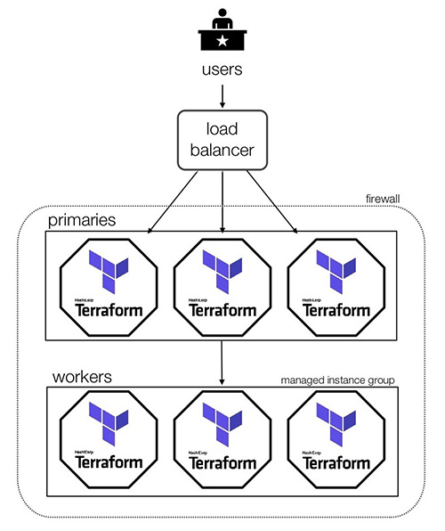

#Terraform Enterprise HA (Beta) Example

This example assumes you have already set up your gcp project with the required prereqs:

	* VPC
	* Subnet specifically for Terrafrom Enterprise
	* Firewall rules as outlined [in the instructions](link_to_website_instructions)
	* A valid certificate and ssl policy in gcp. (If you are not going to use a google managed ssl certificate, plesae [read the instructions here on what to comment out](link_to_instructions))
	* An IP address and DNS entry for the front end load balancer
	* A DNS Zone in gcp
	* A license file provided by your Technical Account Manager

With this code you can either create a single instance, or a build a cluster:



## Change to the example directory

```
cd examples/root-example
```

## Install Terraform

Install Terraform if it is not already installed (visit [terraform.io](https://terraform.io) for other distributions):

```
../terraform-install.sh
```

## Set the desired options in the module block

You'll need to update the following settings to your set up:
	* `project`: name of the project
	* `creds`: json file name
	* `publicip`: The IP address to attach to the load balancer
	* `domain`: domain to use
	* `dnszone`: the name of the dns zone in gcp
	* `cert`: the api url of the google certficiate to use
	* `sslpolicy`: name of the ssl policy to use
	* `subnet`: subnet to deploy into (this should be reserved for tfe)

 This example is set to spin up a single instance, but the `primary_count` and `worker_count` can be updated to build a cluster instead.  

## Run Terraform
```
terraform init
terraform apply
```

## Wait for the application to load

The replicated console url will output along with the password. You can log into that dashboard at that url and wait for the application to be ready. This can take up to 30 minutes! Once complete use the `Open` link to set up the admin user and initial organization. 